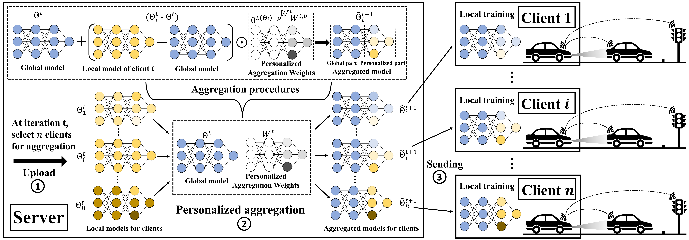
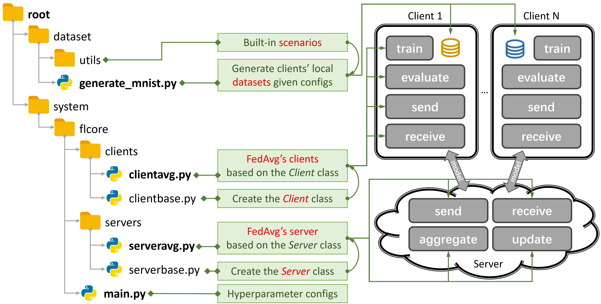

# FedPAW: Federated Learning with Personalized Aggregation Weights for Urban Vehicle Speed Prediction




[](https://www.gnu.org/licenses/old-licenses/gpl-2.0.en.html) [](https://arxiv.org/abs/2312.04992)



This project [PFLlibVSP](https://github.com/heyuepeng/PFLlibVSP) is based on the open source project [PFLlib](https://github.com/TsingZ0/PFLlib) development.

## Environments
Install [CUDA](https://developer.nvidia.com/cuda-11-6-0-download-archive). 

Install [conda](https://repo.anaconda.com/miniconda/Miniconda3-latest-Linux-x86_64.sh) and activate conda. 

```bash
conda env create -f env_cuda_latest.yaml # You may need to downgrade the torch using pip to match CUDA version
```

## How to start simulating (examples for FedAvg)

- Create proper environments (see [Environments](#environments)).

- Download [this project](https://github.com/heyuepeng/PFLlibVSP) to an appropriate location using [git](https://git-scm.com/).
    ```bash
    git clone https://github.com/heyuepeng/PFLlibVSP.git
    ```

- Run evaluation: 
    ```bash
    cd ./system
    python main.py -data driving -algo FedAvg -gr 300 -did 0 # using the driving dataset, the FedAvg algorithm, train 300 rounds
    ```
    Or you can uncomment the lines you need in `./system/examples.sh` and run:
    ```bash
    cd ./system
    sh examples.sh
    ```

**Note**: The hyper-parameters have not been tuned for the algorithms. The values in `./system/examples.sh` are just examples. You need to tune the hyper-parameters by yourself. 

## Datasets

Our dataset CarlaVSP is available from that link: https://pan.baidu.com/s/1qs8fxUvSPERV3C9i6pfUIw?pwd=tl3e.
